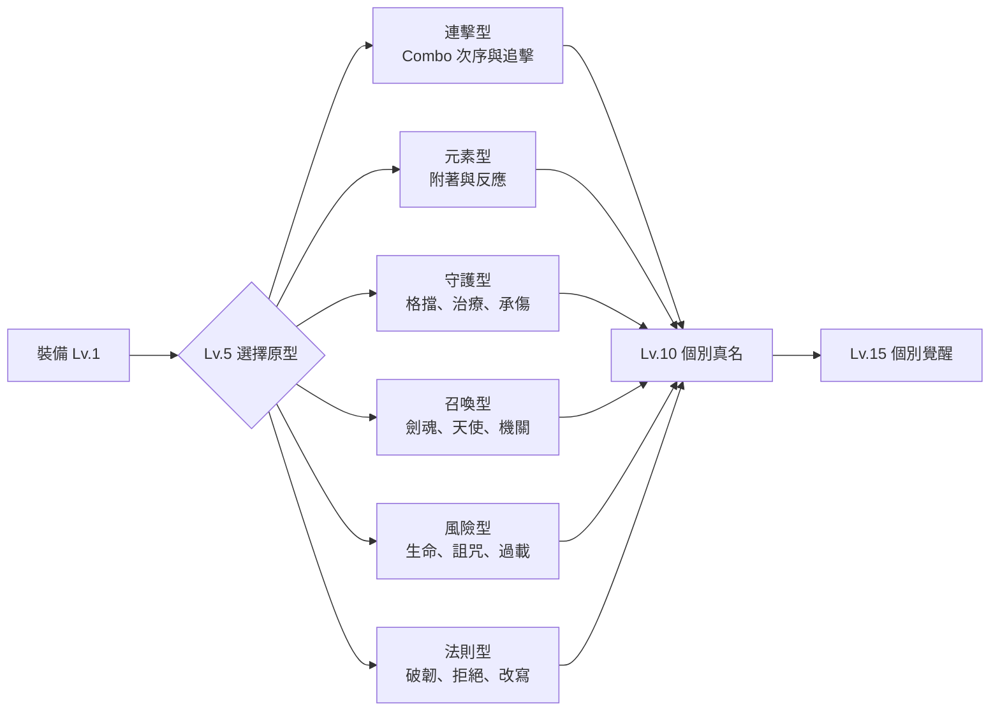

# 擴充裝備圖鑑與進化條件

## 裝備池規模

現有與既定劇情裝備共 19 件。本文件新增 36 件，使規劃總數達 **55 件**：武器 19、防具 17、飾品 19。每件都有固定身分，避免只靠隨機詞條製造假數量。

## 六種進化原型

同一原型共用基礎素材，但 Lv.10 與 Lv.15 必須完成各裝備自己的條件。

每件裝備在表格中的「原型」只是起點，不是唯一走法。達成跨原型行為後可開出混種分支，例如雷棘拳甲可從連擊轉成元素天候；晨鐘祭袍可從守護轉成法則型「禁止死亡」；王座鎖甲可從風險轉成解契型，永久放棄王權疊層換取穩定自由。

## 新增武器 11 件

| 裝備 | 類型／屬性 | 固有詞條 | 取得來源 | 原型 | Lv.5 條件 | Lv.10 真名條件 | Lv.15 覺醒條件／能力 |
|---|---|---|---|---|---|---|---|
| 秋脈大劍 | 大劍／普通 | 蓄力提高破韌 | 秋季礦坑圖紙 | 連擊 | 一擊破兩名敵人姿態 | 不受傷擊敗礦坑巨像 | 以終結技破王甲；覺醒「山脈斷面」切開全場姿態條 |
| 潮聲雙刃 | 雙刀／水 | 左右斬交替回 AP | 河港遺址 | 連擊 | 20 秒內維持交替不斷 | 找回雙胞胎刀魂 | 無重複卡通關；覺醒「雙潮歸海」重播整段連擊 |
| 灰燼戰鎚 | 戰鎚／火 | 重擊引爆燃燒 | 天界焚城官 | 元素 | 一擊引爆五層燃燒 | 用敵火完成復仇而不殺俘虜 | 熄滅三座戰火；覺醒「灰燼不再征戰」將燃燒轉為破韌波 |
| 霜墓長槍 | 長槍／冰 | 突刺碎裂凍結 | 冰原墓園 | 元素 | 一槍穿三名霜緩敵 | 聽完墓園守軍遺言 | 不打碎友方冰像；覺醒「墓門列陣」召喚冰槍軍勢 |
| 雷棘拳甲 | 拳套／雷 | 近身連打疊感電 | 瘋狂科學家研究 | 連擊 | 一輪連打觸發三次感電 | 徒手擊敗第零實驗體副型 | 零受擊完成過載試煉；覺醒「萬雷入骨」每拳連鎖全場 |
| 腐花鐮刀 | 鐮刀／毒 | 擊倒使毒擴散 | 地界腐園 | 風險 | 一次擴毒命中四敵 | 選擇保存而非燒毀腐園 | 以毒治癒腐園核心；覺醒「死亡亦會開花」敵亡時生成治療花 |
| 無影短劍 | 匕首／暗 | 背擊留下咒痕 | 禁書司祭 | 風險 | 不被發現完成一次遭遇 | 找回被刪刺客真名 | 拒絕暗殺任務；覺醒「影子不替王殺人」可背刺敵方規則投影 |
| 朝露聖槍 | 長槍／光 | 治療後下次突刺增幅 | 聖女支線 | 守護 | 替友治療後擊破菁英 | 在審判中替敵人求情 | 不使用處決擊敗聖騎長；覺醒「黎明先照無罪者」全場治療化光槍 |
| 風葬弩砲 | 重弩／風 | 擊退距離轉傷害 | 天界砲台殘骸 | 召喚 | 將敵人推入三種地形 | 讓砲魂選擇不再守城 | 拆除而非占領砲台；覺醒「城牆向外倒下」召喚反向砲列 |
| 巡禮法典 | 法器／光水 | 走過元素地面蓄頁 | 聖女與巫女合作 | 法則 | 收集三種地面狀態 | 完成二人的共同坦白事件 | 用八屬性完成巡禮；覺醒「無神亦可祈願」自由書寫一次祝福 |
| 因果剪 | 奇兵／普通暗 | 剪斷敵方連線效果 | 天穹觀測機 | 法則 | 切斷十次連鎖攻擊 | 剪去自己的虛假童年記錄 | 放棄完美未來；覺醒「未發生也是真實」取消一次 Boss 階段回溯 |

## 新增防具 12 件

| 裝備 | 定位 | 固有詞條 | 取得來源 | 原型 | Lv.5 條件 | Lv.10 真名條件 | Lv.15 覺醒條件／能力 |
|---|---|---|---|---|---|---|---|
| 秋木胸甲 | 生命／自然 | 靜止時回復姿態 | 枯葉守護者 | 守護 | 擋下樹根連擊 | 修復守護者巢穴 | 不砍古樹通關；覺醒「森林替你站立」生成巨木屏障 |
| 河霧斗篷 | 迴避／水 | Dash 留潮濕霧 | 河港商隊 | 元素 | 霧中避開十擊 | 找回失蹤引路人 | 無地圖通過水域；覺醒「迷路也是道路」全場霧化且友軍可見 |
| 焦土重鎧 | 防禦／火 | 受擊儲存熱量 | 焚城戰場 | 風險 | 儲熱滿值不爆炸 | 釋放鎧內士兵殘魂 | 承受王級火攻；覺醒「最後壁爐」把傷害轉為隊伍暖焰 |
| 霜紋披肩 | 控場／冰 | 近敵自動疊霜 | 冰原祭壇 | 元素 | 同時霜緩五敵 | 解開祭壇婚誓 | 保護冰像過王戰；覺醒「冬日仍會結束」凍結後必定產生破冰增益 |
| 雷導外骨骼 | 機巧／雷 | 受雷擊替機關充能 | 科學家 | 召喚 | 讓三座機關同時滿載 | 承認一次錯誤實驗 | 徒手維修天穹機；覺醒「把天罰接地」吸收全場雷擊反射 |
| 毒醫圍裙 | 治療／毒 | 中毒量提高治療 | 地界醫師幻影 | 風險 | 帶毒救回低血友方 | 辨明毒與藥的真名 | 不淨化通過腐園；覺醒「劑量由人決定」任意轉換毒與治療 |
| 無燈夜衣 | 潛行／暗 | 黑暗中降低仇恨 | 巫女 | 風險 | 不攻擊穿過巡邏區 | 陪巫女走完無燈路 | 主動顯形保護居民；覺醒「我在黑暗中仍被看見」全隊隱匿但可互見 |
| 晨鐘祭袍 | 支援／光 | 治療時清一層減益 | 聖女 | 守護 | 同時淨化三人 | 敲響被天堂禁止的鐘 | 無傷害完成一場遭遇；覺醒「鐘為活人而鳴」全隊復甦一次 |
| 無旗軍衣 | 攻守／普通 | 無增益時提高全能力 | 守衛 | 法則 | 不用祝福擊敗菁英 | 找回逃兵名冊 | 不屬任一陣營通關；覺醒「沒有旗也能並肩」共享最高基礎屬性 |
| 空間隔離衣 | 機巧／普通 | 降低機關過載傷害 | 第零實驗體 | 召喚 | 承受三次安全事故 | 修補零號而非拆除 | 完成無錯誤實驗；覺醒「錯誤隔離區」把一次團滅封入平行空間 |
| 王座鎖甲 | 重甲／暗 | 擊殺疊王權，受傷加倍 | 地獄王殘骸 | 風險 | 主動釋放滿層王權 | 拒絕王座稱號 | 解放百名亡魂；覺醒「鎖鏈只鎖王」反綁 Boss 的所有權技能 |
| 天律薄衣 | 法則／光 | 預告攻擊傷害降低 | 天堂王殘頁 | 法則 | 完美避開十次預告 | 保留一個不完美錯誤 | 打破唯一解試煉；覺醒「例外即人」宣布一次玩家行動不受法則限制 |

## 新增飾品 13 件

| 裝備 | 固有詞條 | 取得來源 | 原型 | Lv.5 條件 | Lv.10 真名條件 | Lv.15 覺醒條件／能力 |
|---|---|---|---|---|---|---|
| 秋葉哨 | Dash 後引風 | 守衛巡邏 | 連擊 | 連續三次空中 Dash | 找到哨子的孩子 | 完成全城撤離；覺醒「所有人聽得見」召集 NPC 援擊 |
| 河神空瓶 | 收集水狀態 | 河港遺址 | 元素 | 收集十次潮濕 | 證明瓶中沒有神 | 以空瓶抵達源頭；覺醒「河流不屬於神」重置全場元素地面 |
| 火種扣 | 低血提高燃燒 | Town 火炬 | 風險 | 低血擊敗菁英 | 分出自己的希望之火 | 在 Town 毀滅後保火；覺醒「一火萬家」燃燒不再傷害友方 |
| 冰裂耳墜 | 碎裂回 AP | 冰原墓園 | 元素 | 連碎五名敵人 | 聽見墓園最後歌聲 | 解凍所有無名墓；覺醒「霜葬不是遺忘」碎裂召回記憶攻擊 |
| 雷鳴義眼 | 顯示導電路徑 | 科學家 | 召喚 | 完成三次鏈雷 | 接受不完美校準 | 閉眼擊敗觀測機；覺醒「看見不等於決定」自由重畫一次鏈路 |
| 腐香囊 | 毒死亡擴散 | 巫女藥圃 | 風險 | 一次擴散五敵 | 種活地界毒花 | 不殺腐化居民；覺醒「毒也記得春天」死亡擴散改成復甦孢子 |
| 月蝕髮簪 | 光暗交替增幅 | 巫女與聖女 | 元素 | 交替六次不重複 | 完成二人和解事件 | 同時承受光暗王技；覺醒「蝕不是消失」同時保留光暗狀態 |
| 破旗徽章 | 對陣營敵人破韌 | 戰場亡魂 | 法則 | 擊破三種陣營菁英 | 燒掉歸屬名冊 | 無旗通關雙界；覺醒「人不屬旗」免疫陣營壓制 |
| 店長暗帳 | 素材可換臨時道具 | 店長羈絆 | 召喚 | 完成十次公平交易 | 看見帳本救濟頁 | 散盡一次遠征所得；覺醒「欠款由我記得」免費複製一次消耗品 |
| 守衛舊哨章 | 格擋後召槍影 | 守衛羈絆 | 守護 | 完美格擋十次 | 替守衛值完最後一夜 | 守住破城入口；覺醒「換班了」召喚無名軍勢接替防線 |
| 虛假全家福 | 額外一張卡但偶爾鎖定 | 正史英雄 | 風險 | 使用鎖定卡獲勝 | 親手承認童年是假的 | 不摧毀照片通關；覺醒「假的愛也留下真選擇」自選一段虛假記憶化技能 |
| 地獄通行骨 | 無視一次地界門禁 | 地界獵犬王 | 法則 | 釋放被關亡魂 | 折斷王室印記 | 步行離開地獄；覺醒「門由離開者定義」建立任意短距傳送門 |
| 天堂空白頁 | 預存一張卡 | 天界記錄官 | 法則 | 不照預告出牌獲勝 | 寫下未被允許的名字 | 撕毀完美結局；覺醒「下一頁還沒寫」每場一次重選 Boss 階段結果 |

## 新裝備的小躍進條件

上述表格列出每件最重要的 Lv.5／10／15 條件；Lv.3／6／9／12 仍遵循共通門檻，但「特殊觸發」依固有詞條判定：

- 連擊型：在 Combo 時限內完成指定次序。
- 元素型：觸發克制或二次元素反應。
- 守護型：完美格擋、有效治療或替人承傷。
- 召喚型：讓召喚物完成命中、保護或機關連線。
- 風險型：在高風險狀態下達成目標並存活。
- 法則型：破解 Boss 特殊規則，而非只造成傷害。

## 圖鑑導航

- [[05_戰鬥設計/裝備詞條與進化路線]]
- [[05_戰鬥設計/裝備素材圖紙與成長]]
- [[05_戰鬥設計/裝備傳說與來歷]]
- [[05_戰鬥設計/角色羈絆與劇情戰技解鎖]]
