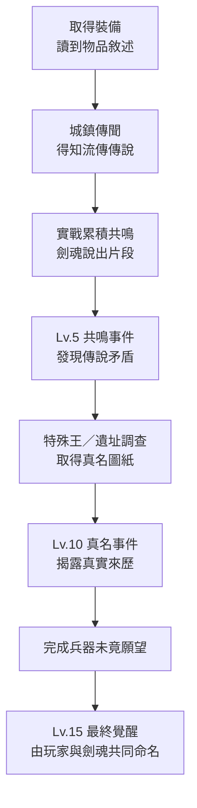

# 武器裝備敘述、傳說與來歷

## 敘事呈現方式

每件重要裝備具有三層文字：

1. **物品敘述**：玩家取得時立即看見。
2. **流傳傳說**：城鎮、天堂或地界相信的版本，可能被政治修改。
3. **真實來歷**：透過劍魂溝通、NPC 調查或 Lv.10 真名事件揭露。

## 現行武器

### Iron Sword／鐵劍

**物品敘述**
一把重量適中、沒有紋章的量產鐵劍。刃上有七處修補痕，握柄卻只磨損了一側。

**流傳傳說**
據說它屬於一名獨自守橋七日、直到援軍抵達的無名英雄。

**真實來歷**
橋從來沒有援軍。持劍者只是替逃難者爭取七分鐘，後來的國家把「七分鐘」改成「七日」，好讓敗退看起來像勝利。劍魂不在乎英雄稱號，只想知道那些人是否成功過河。

### Hunter Bow／獵弓

**物品敘述**
以秋林心材製成的短弓。弓背刻著風向，而非獵物數量。

**流傳傳說**
獵人只要聽見弓弦低鳴，就能射中藏在霧後的野獸。

**真實來歷**
最初的主人從不獵獸。她用箭割斷戰場旗繩，讓被迫參戰的村民看不見軍旗，趁混亂逃走。弓魂討厭「命中注定」這四個字。

### Apprentice Staff／學徒法杖

**物品敘述**
杖身太短、導魔環略歪，卻總能在持有者力竭前多擠出一點魔力。

**流傳傳說**
某位偉大賢者學徒時代的第一把法杖，因此殘留天才的祝福。

**真實來歷**
它是落榜學徒們共用的練習杖。每個人都留下微弱的施法習慣，所以它不是天才遺物，而是一群普通人互相修正後的成果。這正是它能穩定回復 AP 的原因。

## 現行防具

### Leather Armor／皮甲

**物品敘述**
由不同顏色皮片拼成，肩帶縫了又拆，顯然轉手過許多人。

**傳說與真相**
商人說它曾屬於百戰傭兵；實際上它是逃難隊伍輪流穿的共用護甲。每一道補丁都對應一個活著抵達下一座村莊的人。

### Chain Armor／鎖甲

**物品敘述**
沉重鎖環上混著天界銀與地界黑鐵，兩種材料本應互相排斥。

**傳說與真相**
雙方都聲稱它是敵軍偷走的技術。真正打造它的是兩名被困坑道的敵對士兵；他們拆掉各自軍服的金屬，做出一件能讓其中一人活著求援的鎖甲。

### Mage Robe／法師長袍

**物品敘述**
袍內寫滿失敗公式，外側則被人仔細染成莊重的深藍色。

**傳說與真相**
學院稱它是優等生制服；它其實屬於一名總是算錯的研究者。錯誤公式意外形成許多微小回路，使法力能在布料中循環。科學家稱其為「統計學上的奇蹟」。

## 現行飾品

### Swift Ring／迅捷戒

**物品敘述**
戒面沒有寶石，只有一道像是向前延伸的刻痕。

**來歷**
屬於一名從戰場逃走的傳令兵。他被史書稱為懦夫，卻因逃跑改道而最先發現村莊遭襲，救下整條街。森林守護者承認他的選擇後，戒指才解鎖真正的 Dash 能力。

### Vitality Charm／生命護符

**物品敘述**
內部塞著乾草、糖紙與一小截繃帶，沒有任何昂貴材料。

**來歷**
戰地治療者請每位康復者放入一件「想活下去的理由」。護符的治療力並非神術，而是許多微小願望被希望放大。

### Focus Amulet／專注護符

**物品敘述**
中央鏡片有一道裂縫，透過它看東西反而比完整時清楚。

**來歷**
製作者相信完美鏡面能看見唯一答案，直到裂縫讓他同時看見兩條路。護符因此能降低 Combo 負擔，卻無法替持有者決定該走哪一條。

### Merchant Seal／商旅印章

**物品敘述**
蓋出的圖案不是家徽，而是一扇半開的門。

**來歷**
第一任店長在天堂與地界封鎖期間偽造通行證，把藥物送進中立村落。後人把她寫成富商，她本人則在帳本最後一頁寫道：「賺錢是為了讓門繼續開著。」

## 劇情裝備

### 守望者聖盾

**物品敘述**
盾面向內凹陷，像曾有人從盾後方打了它一拳。

**傳說**
天堂記載，持盾者直到死亡都沒有後退一步。

**真相**
他最後確實後退了——為了把身後受傷的人推離審判光束。聖女因此拒絕修平凹痕，稱那是盾最勇敢的地方。

### 斷翼聖鎧

**物品敘述**
鎧甲只保留一側翼骨，穿上後重心並不平衡。

**來歷**
天界審判官斬掉自己的一翼，避免神諭強迫身體追殺平民。天堂稱之墮落；劍魂稱之為他第一次真正飛翔。

### 熾天核心

**物品敘述**
一團不肯維持固定形狀的光，靠近聖女時像心臟，靠近主角時像火。

**來歷**
它不是大天使的器官，而是大天使當年違抗天堂、決定保護 Town 的那一瞬間。聖女繼承的是那次選擇，不是大天使的身分。

### 無月法鈴

**物品敘述**
鈴舌已被取下，搖動時卻能聽見遠處有人回答。

**來歷**
地界王室用它召回逃亡者的靈魂。巫女拔掉鈴舌後，它不再命令人回來，只會詢問：「你願意回答嗎？」

### 地界王女披風

**物品敘述**
披風內襯繡滿被劃掉的姓名，最下方留著一塊空白。

**來歷**
每個名字都是被王室從繼承序列抹除的人。巫女沒有把自己的名字補回去，而是把空白留給下一個拒絕王位的人。

### 相位扳手

**物品敘述**
能轉緊現實中不存在的螺絲。握久了，附近物件偶爾會晚半秒落地。

**來歷**
科學家為修理空間裂縫打造的第三十七號工具。前三十六把全都爆炸；她堅持第三十七把「只是偶爾不同意因果順序」。

### 零號觀測鏡

**物品敘述**
鏡片總會比現實早一瞬間映出結果，但從不顯示持有者的臉。

**來歷**
天穹觀測機用它刪除低機率未來。科學家將刪除功能反轉，使它能保留一次本來不會發生的行動。

### 萬魂空劍

**物品敘述**
沒有劍刃，只有握柄與一道容許任何聲音通過的空隙。

**傳說**
地獄王宣稱只有亡者之王能使它成形。

**真相**
它從不服從王。每次揮動，都是不同靈魂自願成為一瞬間的劍刃；因此它沒有固定屬性，也沒有永遠的主人。

### 無冕火種

**物品敘述**
一簇沒有中心的火。每個靠近它的人，都會看見火焰向自己傾斜。

**傳說**
天堂稱它為王冠破碎後殘留的神火。

**真相**
它是天堂王被擊敗後，從「唯一正確未來」中逃出的所有微小選擇。它拒絕戴在任何人頭上，只願意被分享。

## 解鎖敘事節奏

## 相關文件

- [[05_戰鬥設計/裝備詞條與進化路線]]
- [[05_戰鬥設計/裝備素材圖紙與成長]]
- [[02_角色與勢力/角色/主角]]
