# 裝備詞條與進化升級路線

## 詞條結構

每件裝備由四種能力構成，避免所有成長都只是攻擊百分比：

| 類型 | 數量 | 功能 |
|---|---:|---|
| 固有詞條 | 1 | 裝備的核心身分，不可洗掉 |
| 鍛造詞條 | 1–3 | 一般升級取得，可重鑄 |
| 魂名詞條 | 1 | Lv.10 真名事件後解鎖，與來歷和劍魂有關 |
| 覺醒詞條 | 1 | Lv.15 最終能力，不進入隨機池 |

詞條顯示範例：

> **記名者・Iron Sword +10**
> 固有【淬鍊鋒刃】：攻擊卡傷害提高。
> 鍛造【連奏】：連續使用不同 Combo family 時延長共鳴。
> 鍛造【破陣】：對姿態護甲造成額外破韌。
> 魂名【最後一擊】：具名終結技重演劍魂生前最後一斬。

## 詞條稀有度

| 等級 | 名稱 | 取得方式 | 定位 |
|---|---|---|---|
| I | 粗鍛 | Lv.1–4、普通素材 | 單一數值或基礎手感 |
| II | 精鍛 | Lv.3–8、菁英素材 | 支援一種卡牌 family |
| III | 魂紋 | Lv.6–12、Boss 素材 | 條件觸發與元素反應 |
| IV | 真名 | Lv.10 劇情事件 | 改變戰鬥循環，不可隨機取得 |
| V | 傳說 | Lv.15 覺醒 | 每件裝備獨有的規則能力 |

## 通用詞條池

### 武器詞條

| 詞條 | 能力 |
|---|---|
| 鋒利 | 提高普攻與攻擊卡傷害 |
| 破陣 | 提高破韌，對法則護甲額外有效 |
| 連奏 | 連續打出不同 Combo family 時延長 Combo |
| 餘響 | 終結技後追加一次較弱追擊 |
| 噬魔 | 命中施法中的敵人時回復少量 AP |
| 導流 | 武器主屬性狀態累積提高 |
| 逆剋 | 使用被敵人克制的屬性時，降低傷害懲罰 |
| 處刑 | 對低生命敵人提高傷害，但對 Boss 只提高破韌 |

### 防具詞條

| 詞條 | 能力 |
|---|---|
| 堅韌 | 提高生命或防禦 |
| 卸力 | 受重擊時降低擊退，帶內置冷卻 |
| 守誓 | 替友方承傷後獲得護盾 |
| 反震 | 完美格擋後造成姿態傷害 |
| 淨化內襯 | 縮短毒、咒痕或燃燒時間 |
| 元素夾層 | 選定一種屬性抗性；進城才能更換 |
| 不屈 | 低生命時提高防禦，不能與無敵疊加 |

### 飾品詞條

| 詞條 | 能力 |
|---|---|
| 聚氣 | AP 回復提高 |
| 迅步 | Dash 距離或迴避窗提高 |
| 靈視 | 更早顯示敵人弱點提示 |
| 蓄願 | 治療溢出轉為短暫護盾 |
| 價差 | 商店折扣或額外選項，不提高戰鬥傷害 |
| 共鳴槽 | 提高 Combo 疊層上限 |
| 倒影 | 每場首次使用的指定類型卡產生弱化複本 |

## 劇情限定詞條

| 詞條 | 來源 | 能力 |
|---|---|---|
| 誓光 | 聖女 | 格擋、承傷、救援會累積光；滿值強化聖騎士卡 |
| 斷翼 | 天界審判官 | 清除投射物後生成一次光翼反擊 |
| 真名咒 | 巫女 | 對同一敵人完成三次標記後封鎖其一個招式 |
| 王血魂火 | 地界獵犬王 | 生命施法後以魂火護盾返還部分代價 |
| 實驗資料 | 科學家 | 命中不同目標取得資料，提升場上機關等級 |
| 因果殘像 | 天穹觀測機 | 倒序重播上一張 Combo 的弱化版本 |
| 釋魂 | 地獄王 | 擊敗敵人不吸收其靈魂，轉成一次自由意志增幅 |
| 無冕 | 天堂王 | 可拒絕一項祝福效果，換成全隊共享的希望光環 |

## 重鑄規則

- 固有、魂名、覺醒詞條不可洗掉。
- 鍛造詞條可在鐵匠鋪重鑄，一次只鎖定一條，避免無限低成本洗裝。
- 劇情限定詞條必須先取得對應圖紙或 Boss 記憶，才會進入該裝備的可選池。
- Lv.10 後重鑄需要「記憶灰」。一般裝備的 Lv.15 覺醒分支可用高階重鑄器材切換；只有具名傳說／劇情裝備需要透過一次性故事事件首次解鎖其特殊分支。

## 通用 Lv.1–Lv.15 進化路線

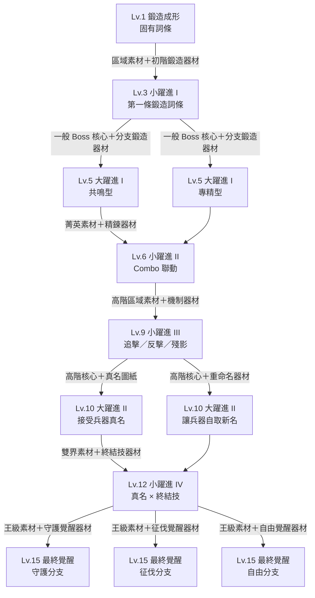

上圖是一般裝備的正式進化路線。具名傳說／劇情裝備可在 Lv.10 或 Lv.15 的素材欄多一個故事關鍵物，但不得以無傷、低血、限卡、指定擊殺或多次通關作為必要條件。

## 每階突破的素材條件

| 節點 | 必要素材／設施 | 可選共鳴紀錄（不阻擋升級） |
|---|---|---|
| Lv.3 | 區域素材、初階鍛造器材 | 使用固有詞條可取得額外精鍊素材 |
| Lv.5 | 一般 Boss 核心、分支鍛造器材、工坊 Tier 1 | 共鳴對話或流派挑戰可解鎖外觀 |
| Lv.6 | 菁英素材、精鍊器材 | 用核心玩法完成菁英戰可提高下一次素材掉率 |
| Lv.9 | 高階區域素材、機制器材、工坊 Tier 2 | 特殊觸發紀錄可解鎖圖鑑章 |
| Lv.10 | 高階核心、真名圖紙；特殊裝備另需故事關鍵物 | 真名事件提供特殊裝備故事與外觀，不要求重複挑戰 |
| Lv.12 | 天堂與地界素材、終結技器材 | 終結技收尾可額外掉落終結技器材 |
| Lv.15 | 工坊 Tier 3、王級素材、分支覺醒器材；特殊裝備另需故事關鍵物 | 願望或極限挑戰提供稱號、外觀與分支切換捷徑 |

一般裝備只要湊齊必要素材並滿足工坊階段即可升級。共鳴、願望與極限挑戰不得成為大量裝備的硬門檻；特殊裝備只保留一次性故事關鍵物，不採成就式重複條件。

三個 Lv.15 分支不是固定善惡：

- **守護**：保人、格擋、治療與共享能力最強。
- **征伐**：破韌、追擊、處決與 Boss 傷害最強。
- **自由**：換屬、重組 Combo、拒絕敵方規則最強。

## 讓進化真正分歧的規則

進化選項由玩家在鐵匠鋪主動選擇，並消耗對應分支的掉落器材。達到節點時，只要器材齊全，所有適用路線都能選；不以戰鬥次數、無傷、低血、限定 Combo 或指定擊殺方式鎖住分支。裝備仍可記錄玩家行為，用來推薦路線、補充對話或增加素材掉落，但不是升級資格。

### 裝備會記錄的行為

- 最常使用的 Combo family、元素與終結技。
- 完美格擋、替人承傷、低血反殺、無傷戰鬥等行為。
- 玩家如何處理裝備相關亡魂：復仇、寬恕、解放或同行。
- 特殊王的破招方式，而非只有是否擊殺。
- 是否接受天堂／地界提供的捷徑，以及之後有沒有反悔。

以上紀錄只影響推薦標記、共鳴台詞、圖鑑與額外獎勵，不會隱藏或鎖住一般裝備的進化選項。

### 三次核心選擇

| 節點 | 問題 | 結果 |
|---|---|---|
| Lv.5 戰法分歧 | 「你怎麼使用我？」 | 改變觸發條件、手感與外觀部件 |
| Lv.10 真相分歧 | 「你相信我的傳說，還是我的記憶？」 | 可保留傳說能力、揭露真相能力，或熔掉兩者形成第三路線 |
| Lv.15 信念分歧 | 「得到力量後，你要它為何而戰？」 | 守護、征伐、自由只是大類，每件裝備有自己的回答與代價 |

## 六類武器的多元進化網

### 連擊型：節奏、殘響、斷奏

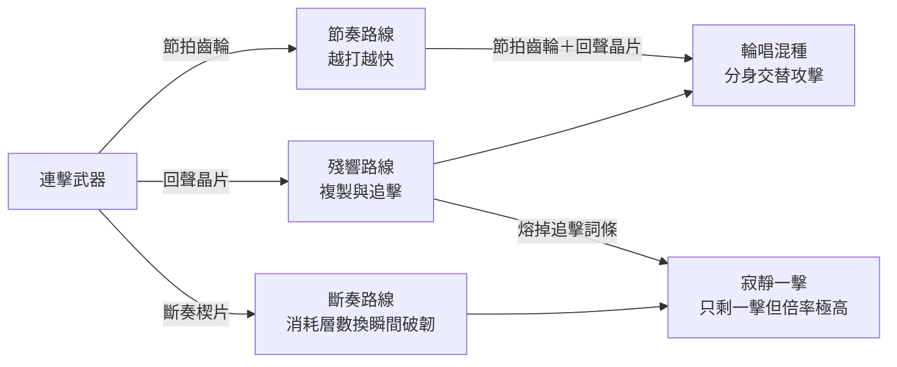

### 元素型：純化、反應、逆剋

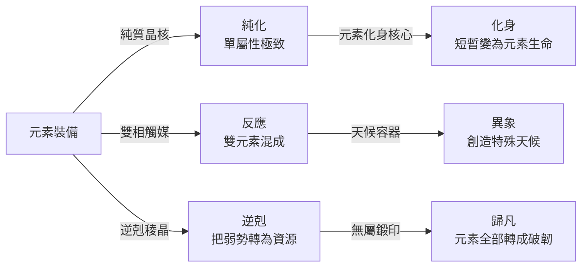

### 守護型：壁壘、代傷、反誓

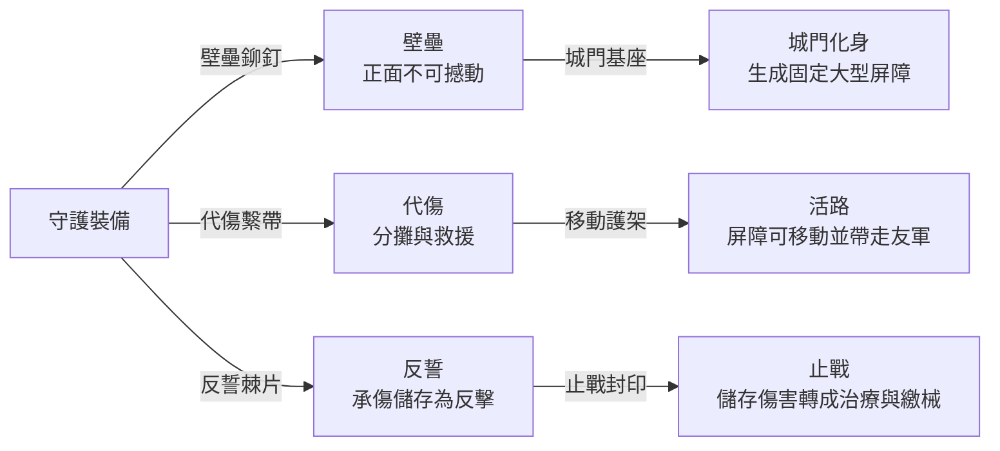

### 召喚型：群體、合體、放生

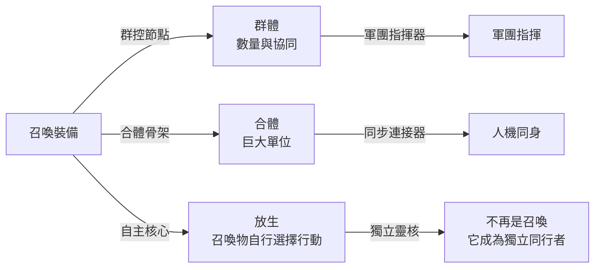

### 風險型：賭命、轉嫁、戒斷

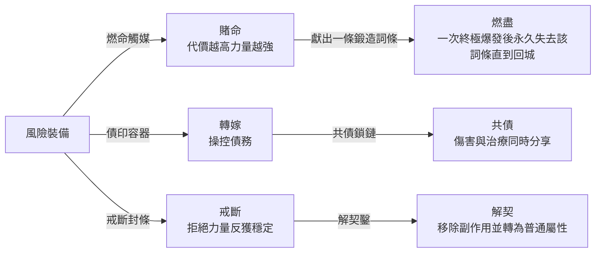

### 法則型：遵守、鑽隙、否決

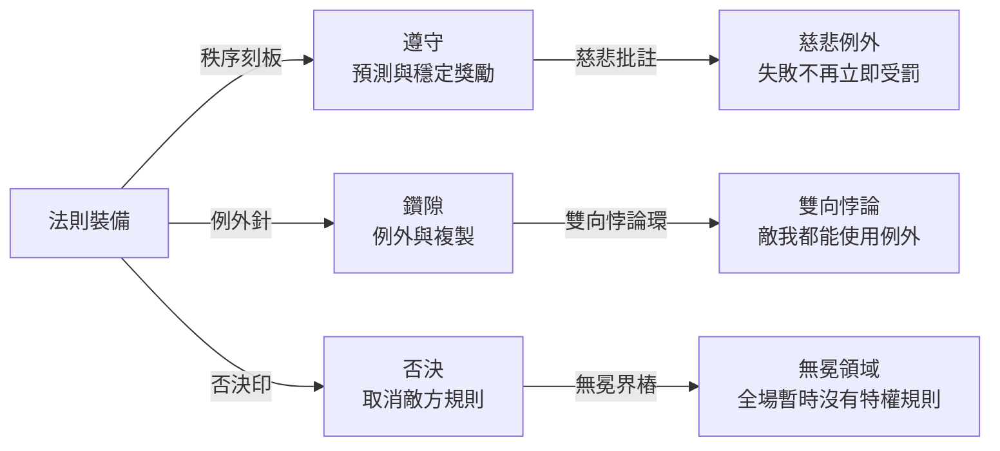

## 異變、拆解與反進化

- **異變進化**：帶著地界瘴氣或天堂法則升級，可得到強力污染詞條；之後有淨化、駕馭、共存三種處理方式。
- **拆詞進化**：Lv.10 可犧牲一條高階鍛造詞條，換取空白槽，放入特殊王能力碎片。
- **反進化**：玩家可以讓 Lv.10 裝備回到 Lv.1 外觀但保留真名能力，用較低數值換取低仇恨、低卡費或特殊 NPC 反應。
- **雙裝共鍛**：兩件 Lv.10 裝備消耗共鍛連接器後，可互換一條非固有詞條；不銷毀裝備。共同記憶只追加特殊對話。
- **拒絕覺醒**：Lv.15 鍛造時可以拒絕終極力量，得到「未完成」版本。面板較弱，但能多帶一張卡或免除覺醒副作用。

## 分支鎖定與回復

- Lv.5 分支可用一般重鑄材料切換，不需重新累積路線熟練。
- 一般裝備的 Lv.10 分支可用高階重命名器材切換；特殊裝備首次切換需看完對應的「重新理解」事件。
- Lv.15 信念不是永久鎖死；一般裝備用高階覺醒器材切換，特殊裝備完成一次願望事件後也能用器材重選。
- 圖鑑保留所有走過的外觀、傳說與對話，不因切換路線消失。

## Iron Sword 進化示例

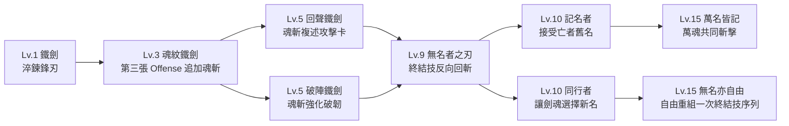

## 數值控制

- 一般等級的主要數值成長保持線性，真正強度放在躍進機制。
- 同類乘區不無限相乘；同來源詞條採加算，跨系統才使用受控乘算。
- Lv.15 應非常強，但每件只極致化一種玩法；終極能力需每場一次、資源蓄積或明確副作用。

## 全武器進化路線

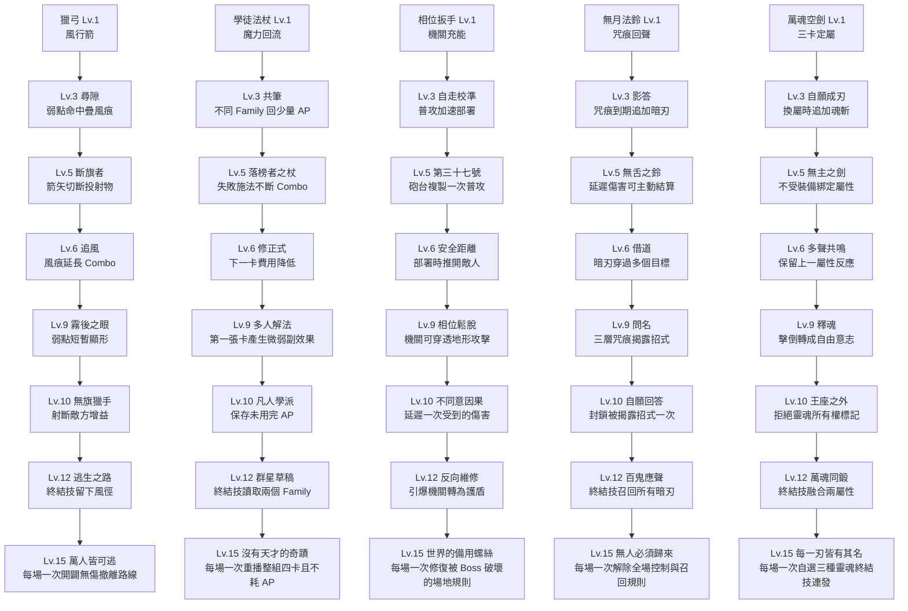

## 全防具進化路線

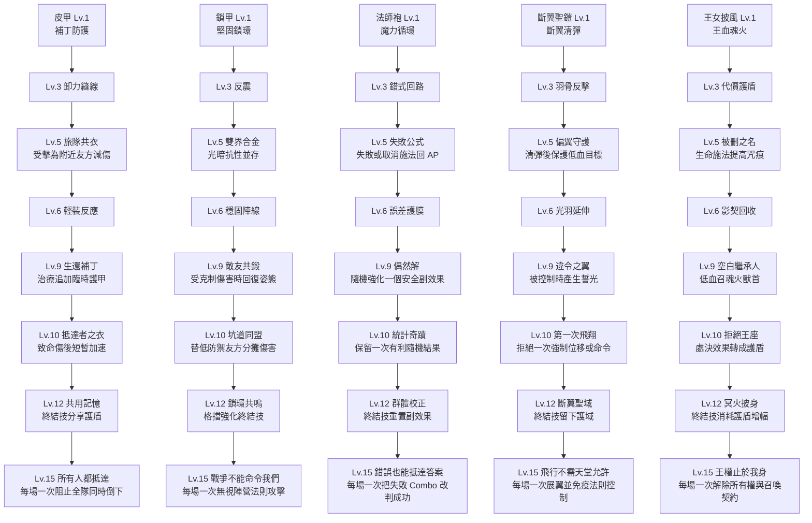

## 全飾品進化路線

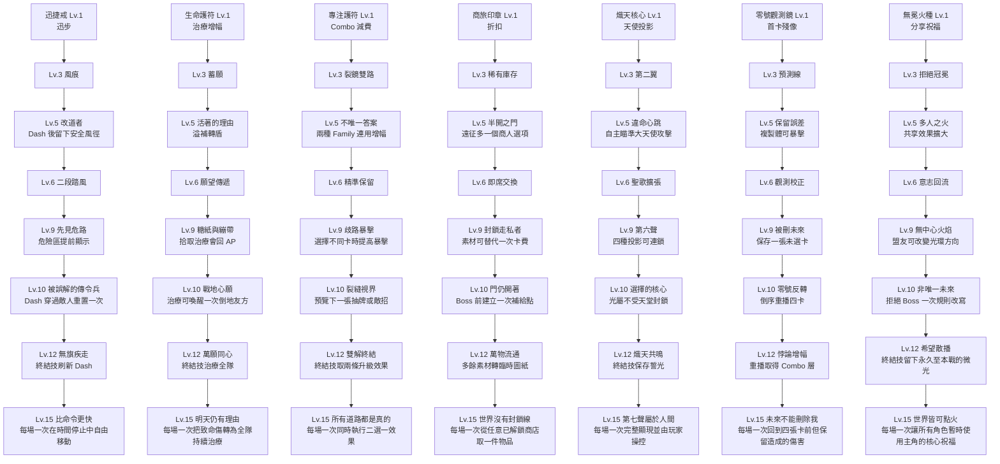

## 全裝備覆蓋檢查

| 類別 | 已記錄 |
|---|---|
| 現行武器 | Iron Sword、Hunter Bow、Apprentice Staff |
| 現行防具 | Leather Armor、Chain Armor、Mage Robe |
| 現行飾品 | Swift Ring、Vitality Charm、Focus Amulet、Merchant Seal |
| 劇情武器 | 無月法鈴、相位扳手、萬魂空劍 |
| 劇情防具 | 斷翼聖鎧、地界王女披風 |
| 劇情飾品 | 守望者聖盾、熾天核心、零號觀測鏡、無冕火種 |

守望者聖盾採聖騎士專屬路線：Lv.3 完美格擋生誓光；Lv.5 盾魂反擊；Lv.6 誓光可分享；Lv.9 替友承傷後刷新格擋；Lv.10 揭露「後退一步」真相；Lv.12 聖壁裁決追加保護區；Lv.15「退一步，萬人得生」可每場一次將全場致命傷擋在盾前。

## 相關文件

- [[05_戰鬥設計/裝備素材圖紙與成長]]
- [[05_戰鬥設計/裝備傳說與來歷]]
- [[05_戰鬥設計/祝福合成與屬性相剋]]
- [[05_戰鬥設計/擴充裝備圖鑑與進化條件]]
